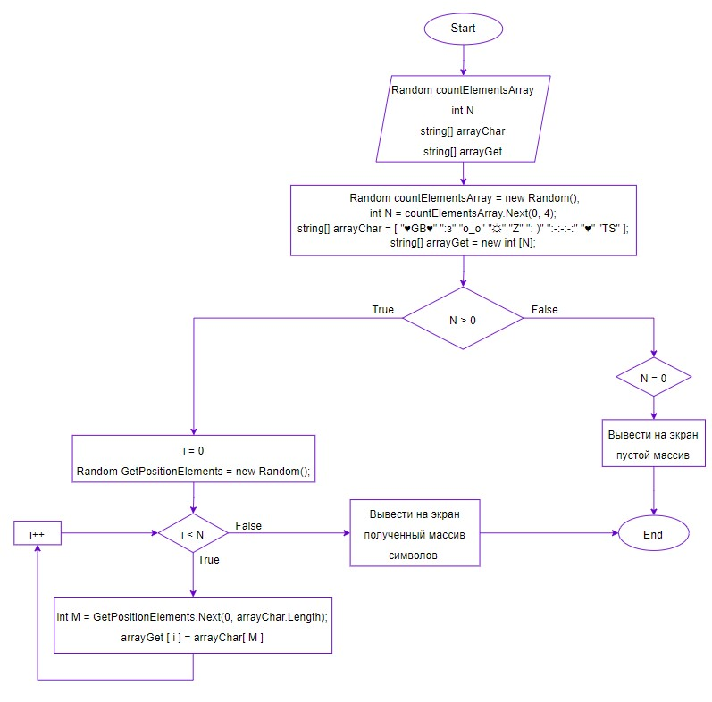

# Написать программу вывода строк из одного массива с имеющимися символами в другой массив но не больше 3-х символов.

## Решение задачи:

1. Так как нам нужно записать во второй массив символы не больше трех, создадим переменную (**countElementsArray**) типа **Random** которая будет отвечать за генерацию случайного числа(**arrayGet**)

        4. Random countElementsArray = new Random();

(_Мы использовали тип Random для того, чтобы в дальнейшем обращаться к нему, а не присваивали каждый раз переменной случайное новое значение, чтобы не выделять лишнее место в памяти для нового числа_)

2. Создадим новую переменную (**N**) типа **int** и присвоим ей значение переменной (**countElementsArray**) и указываем диапазон нужных нам чисел (от 0 до 4 не включительно), она будет отвечать за то сколько символов запишется в наш массив

        6. int N = countElementsArray.Next(0, 4);

3. Выведем сообщение для пользователя что происходит)

        8. Console.WriteLine("<<Выводит три случайных символа из списка имеющихся элементов>>");

4. Создаем первый массив строк (**arrayChar**) и задаем символы

        11. string[] arrayChar = new string[] { "♥GB♥ ", ":з ", "o_o ", "☼ ", "Z ", ":) ", ":-:-:-: ", "♦♦♦ ", "TS " };
    
5. Создаем второй пустой массив строк (**arrayGet**) куда будем записывать полученный результат и указываем его размер (**N**)

        13. string[] arrayGet = new string[N];

6. Создадим метод (**PrintArray**) типа *void* который будет выводить наши массивы на консоль и зададим ему два аргумента (**string text, string[] arr**) где первый аргумент (**text**) будет выводить наше сообщение и второй(**arr**) это наш массив который надо вывести на консоль

        19. void PrintArray(string text, string[] arr)

7. Создаем еще один метод (**GetArrayNElements**) типа **string** который будет записывать в наш второй массив (**arrayGet**) случайные элементы из первого массива (**arrayChar**) и возвращать полученный результат - заполненный второй массив (**arrayGet**). 

        29. string[] GetArrayNElements(string[] array, string[] ar)
    
    (_Где первый аргумент (**array**) - это первый массив (**arrayChar**) и второй аргумент (**ar**) - это второй массив (**arrayGet**)_)

        Описание метода GetArrayNElements:
        1. Если N > 0 то мы переходим в цикл for с условием (int i = 0; i < N; i++), где N - длина массива 
            I. Создаем переменную GetPositionElements типа Random для генерирования случайного числа, как и в первом пункте только уже для того что бы выбрать случайным образом элемент из первого массива arrayChar
            II. Создаем переменную M типа int и присваиваем ей значение GetPositionElements и указываем диапазон нужных нам элементов 
            
                38. int M = GetPositionElements.Next(0, arrayChar.Length);

                (где arrayChar.Length - длина массива )
        
            III. Присваиваем второму массиву аргумента - ar[i] c индексом i = 0, значение одного из элементов первого массива аргумента - array[M] с индексом M = случайный элемент из первого массива arrayChar

                39. ar[i] = array[M];

            IV. Возвращаем полученный заполненный массив "ar"

                41. return ar;

        2. Если же N = 0, то мы получим пустой массив
            I. Выводим на консоль пустой массив
            
            II. Возврощаем полученый пустой массив "ar"  
              
                44. return ar;

8. Теперь осталось только обратиться к нашим методам в правильной последовательности и с аргументами в них

        16. PrintArray("<<Список символов>>", arrayChar);
        17. GetArrayNElements(arrayChar, arrayGet);
        18. PrintArray("<<Получили>>", arrayGet);   

# Блок схема программы

